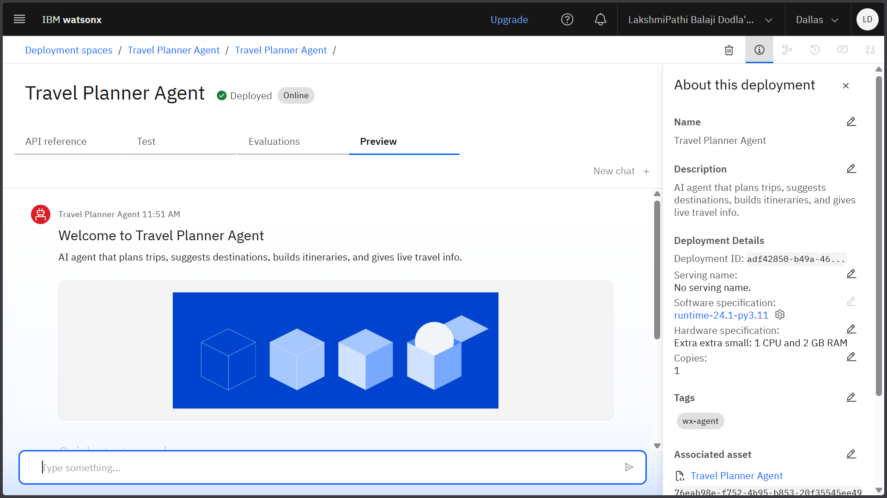
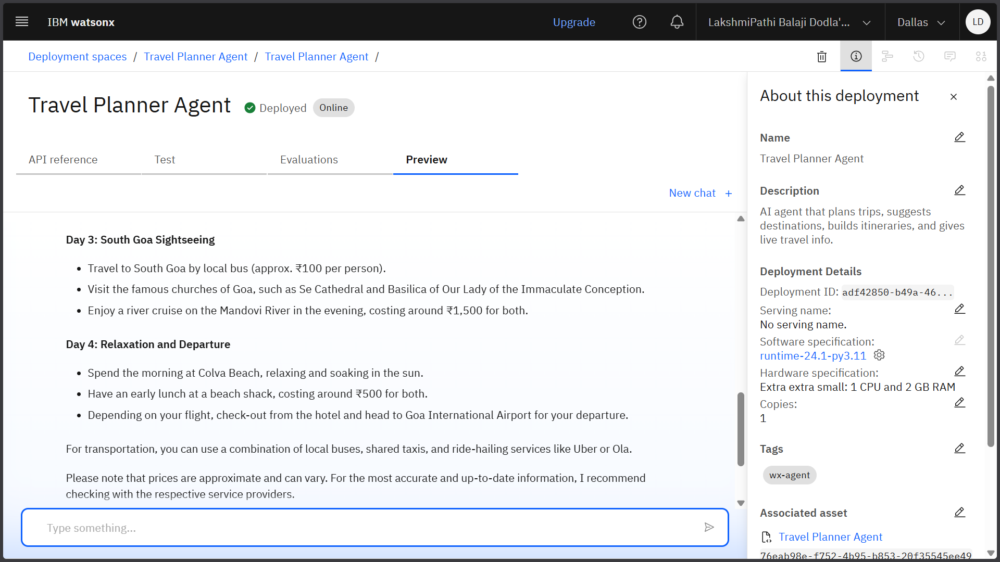
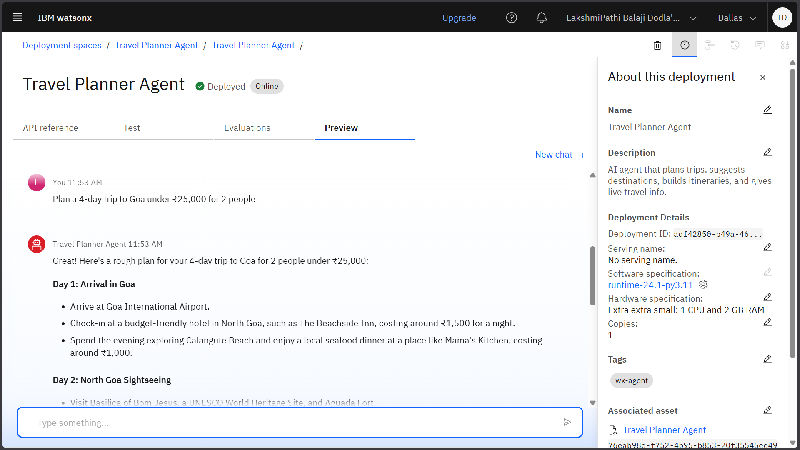

# 🌍 Travel Planner Agent - IBM watsonx.ai

An intelligent AI-powered travel planning assistant built using IBM watsonx.ai Agent Lab and foundation models.

## 🎯 Overview

The Travel Planner Agent helps users plan personalized trips by suggesting destinations, creating detailed itineraries, and recommending transportation and accommodation options based on user preferences, budget constraints, and real-time data.

## ✨ Features

- **Natural Language Processing**: Understands conversational travel queries
- **Real-time Data Integration**: Weather, destinations, pricing via Google Search & APIs
- **Personalized Recommendations**: Custom itineraries based on budget and interests
- **Multi-tool Integration**: Google Search, Weather API, Wikipedia, Web Crawler
- **Instant Planning**: Complete trip plans with activities, timing, and logistics
- **Budget Optimization**: Smart suggestions within specified financial constraints

## 🛠️ Technology Stack

- **Platform**: IBM Cloud watsonx.ai
- **Foundation Model**: IBM Granite
- **Framework**: Agent Lab with RAG architecture
- **Tools**: Google Search, Weather API, Wikipedia Search, Web Crawler
- **Deployment**: IBM Cloud Lite services with REST API endpoint

## 🚀 Getting Started

### Prerequisites
- IBM Cloud account (free tier available)
- Access to IBM watsonx.ai platform
- IBM Skills Build for Academia (recommended)

### Setup Instructions

1. **Create IBM Cloud Account**
2. **Access watsonx.ai Platform** → Create new project
3. **Configure Agent in Agent Lab** → Select IBM Granite model
4. **Enable Tools**: Google Search, Weather, Wikipedia
5. **Deploy Agent** → Choose Testing environment

## 💬 Sample Interactions

### Trip Planning Example

User: "Plan a 4-day trip to Goa under ₹25,000 for 2 people"

Agent: "I'll help you plan an amazing 4-day Goa trip within your budget!
Let me gather current weather and accommodation information...

Day 1: Arrival & North Goa

Weather: 28°C, sunny ☀️

Accommodation: Beach resort in Calangute - ₹2,500/night

Activities: Baga Beach, Anjuna Flea Market

## 📊 Results & Performance

- ⚡ **Response Time**: < 3 seconds for complex queries
- 🎯 **Accuracy**: High-quality, relevant travel suggestions
- 🔧 **Tool Integration**: Seamless real-time data retrieval
- 💬 **User Experience**: Natural conversation flow

## 🏆 Certifications Earned

- ✅ IBM Skills Build - Getting Started with AI
- ✅ IBM Skills Build - Journey to Cloud
- ✅ IBM watsonx.ai Agent Lab Completion
- ✅ RAG Lab Workshop Certificate

## 📸 Screenshots

| Agent Configuration | Deployment Success | Sample Conversation |
|-------------------|-------------------|-------------------|
|  |  |  |

## 🔮 Future Enhancements

- [ ] Direct booking platform integration
- [ ] Multi-language support
- [ ] Voice interface capabilities
- [ ] Mobile app development
- [ ] AR/VR destination previews

## 📁 Project Structure

docs/ # Documentation and presentations
├── project-presentation.pdf
├── screenshots/ # Agent demo screenshots
└── certificates/ # IBM Skills Build certificates

config/ # Agent configuration files
├── agent-instructions.txt

examples/ # Sample queries and responses
├── sample-queries.md

